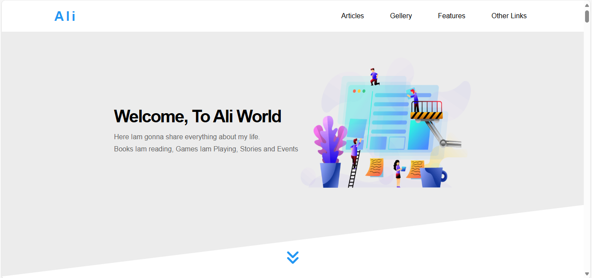

# Responsive Business Landing Page

This project is a simple and modern business landing page. It is built using HTML, CSS, and JavaScript. The design is responsive, so it works well on computers, tablets, and phones.

## Demo

You can see a live demo here:  
https://responsive-business-landing-page.vercel.app/

## Features

- Clean and modern design
- Responsive layout for all devices
- Easy to customize
- Uses HTML, CSS, and JavaScript
- Includes images and icons

## How to Use

1. Download or clone the project files.
2. Open `index.html` in your web browser.
3. Edit the HTML and CSS files to add your business information.

## Folders

- `css_file/` – CSS styles for the page
- `imgs-temp-3/` – Images and icons
- `js-temp3/` – JavaScript files
- `webfonts/` – Font files
